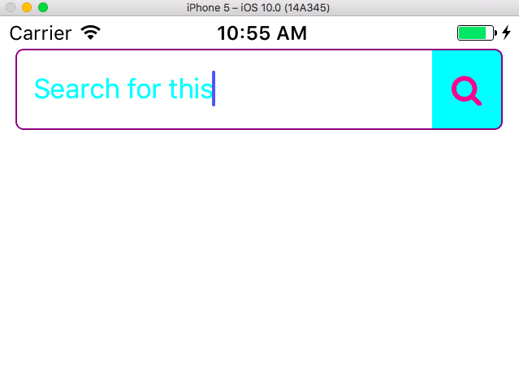
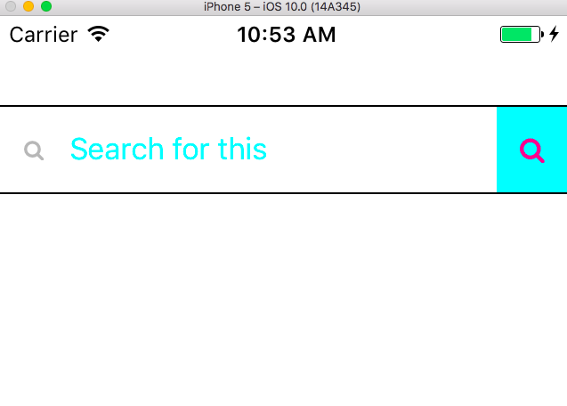

# RN-Search-Bar
<br>
### Uses `react-native-vector-icons/FontAwesome` as the icon source.
<br>
##### You must have `react-native-vector-icons` installed and linked for this to work
<br>  

* `npm install react-native-vector-icons --save`
* `react-native link react-native-vector-icons`
* `npm install rn-search-bar --save`

<br>





```js
import React, { Component } from 'react';

import SearchBar from 'rn-search-bar';

class SearchBarExampleOne extends Component {
  render(){
    return(
      <SearchBar
        onPress={
          () => console.log('Do Stuff')
        }
        containerStyle={{
          height:50,
          borderTopWidth:1,
          borderBottomWidth:1
        }}
        clearTextOnPress={true}
        renderLeftIcon={true}
        searchIconSize={15}
        searchIconColor={'deeppink'}
        searchIconBackgroundColor={'aqua'}
        leftIconColor={'rgba(152,152,152,.7)'}
        leftIconSize={12}
        textStyle={{
          color: 'cyan'
        }}
      />
    )
  };

class SearchBarExampleTwo extends Component {
  render(){
    return(
      <SearchBar
        onPress={
          () => console.log('Do Stuff')
        }
        containerStyle={{
          height:50,
          marginHorizontal: 10,
          borderRadius: 5,
          borderColor: 'purple',
          borderWidth: 1
        }}
        clearTextOnPress={false}
        renderLeftIcon={false}
        searchIconSize={20}
        searchIconColor={'deeppink'}
        searchIconBackgroundColor={'aqua'}
        textStyle={{
          color: 'cyan',
          paddingLeft: 10
        }}
      />
    )
  };
}
```
